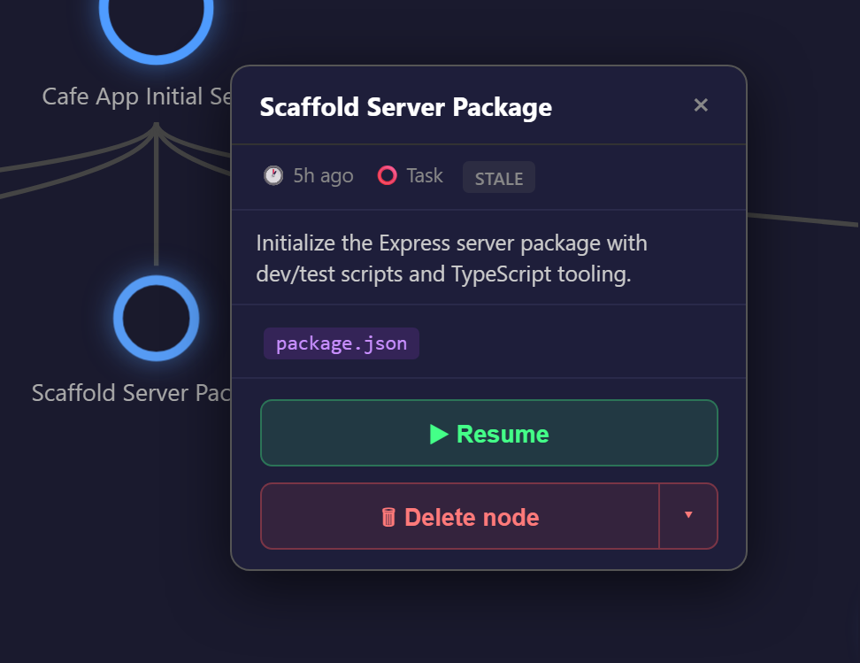
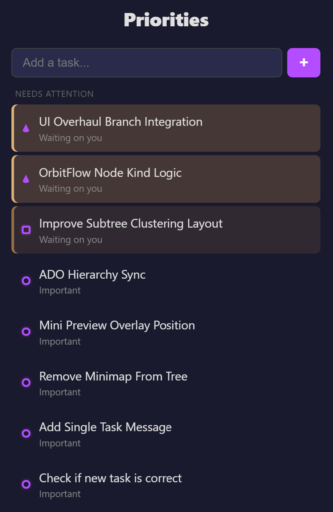

# OrbitFlow

> A cognitive continuity assistant for VS Code that helps you maintain task context, recover unfinished work, and resume flow after interruptions.

OrbitFlow was built for the Intern Hackathon 2026. It is designed for developers — especially neurodivergent developers — who lose their place when they get interrupted, switch contexts, or fall down a rabbit hole. Instead of asking you to manually track your work, OrbitFlow watches your activity (code changes, commits, and Copilot chat sessions) and automatically builds a visual **memory tree** of what you've been doing, so you can pick up exactly where you left off.


## What it does

OrbitFlow runs quietly in the background and:

- **Builds a memory tree automatically.** On startup it infers what you're working on (from your repo, branch, recent commits, and open files) and seeds a tree named after that goal — no setup required.
- **Detects new work as you go.** When your code changes settle, it asks the language model to cluster your working-tree diff into distinct task nodes and adds them to the tree.
- **Tracks your Copilot chat sessions.** Each chat becomes a node. Exploratory/question-driven chats become "idea" nodes; work-driven chats become "session" nodes.
- **Marks tasks done from commits.** When you commit, it checks which open task nodes the commit completes and marks them done — so the tree doubles as a to-do list.
- **Lets you resume in one click.** Resuming a node reopens the right files, jumps to the line you were on, restores recent terminal history, and reopens the related Copilot chat session.
- **Surfaces what needs attention.** A priority list ranks the nodes you should look at next — agent sessions waiting on a reply, urgent work, and stale-but-important tasks.

## Installation

OrbitFlow is a VS Code extension. To build and run it from source:

```bash
# 1. Install dependencies for the extension
npm install

# 2. Install dependencies for the React webview UI
cd webview-ui
npm install
cd ..

# 3. Build the extension and its UI together
npm run build
```

A single `npm run build` bundles both the extension (`dist/extension.js`) and the webview UI (the sidebar tree and the full editor panel) so they never drift out of sync.

To run it:

1. Open this folder in VS Code.
2. Press `F5` to launch an **Extension Development Host** window with OrbitFlow loaded.
3. Click the **OrbitFlow** icon in the Activity Bar to open the memory tree.

### Useful scripts

| Script | What it does |
|---|---|
| `npm run build` | Build the extension and webview UI once. |
| `npm run watch` | Rebuild automatically on file changes. |
| `npm run compile` | Type-check only (no emit). |

**Requirements:** VS Code `^1.90.0`. The Copilot session and language-model features rely on GitHub Copilot being installed and signed in; OrbitFlow degrades gracefully (no-ops) when those aren't available.

## Using the app

OrbitFlow appears as an icon in the Activity Bar. It has **two views of the same memory tree**:

- **Sidebar (compact tree)** — the panel in the Activity Bar. A small, read-only overview: node shapes, colors, and a hover preview. Use the **⤢ Open Full View** button at the bottom for the interactive canvas.
- **Full editor view (working tree)** — a GitLens-style editor tab with the interactive canvas: zoom/pan, minimap, pruning, and the Deep Focus nudge. Open it with **⤢ Open Full View** or the **OrbitFlow: Open Memory Tree in Editor** command.

> Most of the interactive editing (pruning, zoom, minimap, the nudge) lives in the **full editor view**, not the sidebar. If you don't see a control in the Activity Bar panel, open the full view.

### The memory tree

- Each independent task (a repo, an unrelated chat, etc.) gets its own **tree** with its own **base color**.
- **Nodes** are the units of a train of thought — a task step, a chat thread, or an idea.
- The tree grows on its own as you work; you rarely need to edit it by hand.


### Resuming work

- **Hover** a node (in either view) to see a preview with its details, type, time since last active, and the files involved.
- **Click** a node to jump back to it: OrbitFlow reopens the files the task touched (jumping to the line you were on and surfacing your last terminal command), or reopens the related Copilot chat session for chat-derived nodes.
- For a full restore from the priority list, use the **▶ resume** button — it reopens files, jumps to the line, and replays recent terminal history.





### Editing the tree (full editor view)

- **Prune** a subtree using the scissors (✂) button on the edge between two nodes. *(Full editor view only — it is not shown in the sidebar.)*
- **Revert** to the previous version of the tree with the **↶** toolbar button.
- **Clear** all trees and nodes with the **🗑** toolbar button.

Two more tree actions are available from the **sidebar view title bar** and the Command Palette (see [Commands](#commands)):

- **Reorganize** the tree into clean subtrees (the model regroups related subtasks under broader ones).
- **Generate** fresh trees from your current work.

### Navigating the canvas (full editor view)

- **Zoom and pan** with the mouse, or use the on-screen `+` / `−` / reset (⤢) controls.
- A **minimap** in the corner shows the whole tree at a glance.
- A **Deep Focus Alert** nudge appears when you're three or more levels deep from the root, with a one-click way to jump back to where you started.

### The priority list ("Needs Attention")

A separate, linear view that cuts through the tree and shows only what matters right now. It is **not** a 1:1 copy of the tree — it ranks nodes by:

- **Agent sessions waiting on you** (longest-waiting first).
- **Urgent** work.
- **Sessions that need follow-up.**
- **Stale-but-important** tasks you may have abandoned.

You can also add your own manual to-do items to this list.




## What the symbols mean

### Node shapes (node type)

| Shape | Type | Meaning |
|---|---|---|
| ⭕ Circle / dot | **Task** | An actionable step in a task. |
| ⬜ Square | **Session** | A work-driven Copilot chat thread. |
| 🔺 Triangle | **Idea** | A new idea or exploratory/question-driven chat. |

### Color and saturation

- Every tree has its own **base color**. All of its nodes are tinted from that color.
- A node's **saturation reflects its relevance** — more relevant nodes are more vivid, less relevant ones fade out. (By default, nodes deeper in a tree are treated as slightly less relevant, but semantic relevance comes first.)
- The **active node** (the one you're working on now) is drawn in a complementary color and filled in, so it stands out.

### Status markers

| Marker | Meaning |
|---|---|
| Concentric / urgent border around a node | **Urgent** — e.g. a task with a deadline. |
| "Needs attention" highlight | An agent **session finished its turn** and is waiting for your next prompt. |
| Done state | The task is **complete** (often marked automatically when a matching commit lands). |

### Other icons

| Icon | Where | Meaning |
|---|---|---|
| ✂ | Tree edge (full editor view) | Prune this subtree. |
| ↶ | Full editor view toolbar | Revert to the previous tree. |
| 🗑 | Full editor view toolbar | Clear all trees and nodes. |
| ⤢ | Sidebar | Open the full editor view. |
| ▶ | Priority list | Resume this node (full restore). |
| `+` | Priority list | Add a manual task. |
| `+` / `−` / ⤢ | Full editor view canvas | Zoom in / out / reset view. |

## Commands

All commands are available from the Command Palette (`Ctrl+Shift+P`) and as buttons in the OrbitFlow view title bar:

| Command | Description |
|---|---|
| **OrbitFlow: Open Memory Tree in Editor** | Open the full-screen tree as an editor tab. |
| **OrbitFlow: Generate New Memory Trees** | Detect and build fresh trees from your current work. |
| **OrbitFlow: Reorganize Tree into Subtrees** | Let the model regroup nodes into a cleaner hierarchy. |
| **OrbitFlow: Revert to Previous Tree** | Undo the last tree change. |
| **OrbitFlow: Clear Memory Trees** | Remove all trees and nodes. |

## How it works under the hood

OrbitFlow is intentionally low-friction — it observes signals you already produce and turns them into structure:

- **Goal inference & auto-nodes** — It reads your git working-tree diff (debounced after saves) and uses the VS Code language model API (Copilot) to cluster changes into named task nodes. Scratch and temp files (dotfiles, `tmp`/`temp`/`scratch`, backup/swap files) are ignored so they don't create clutter.
- **Copilot session tracking** — It polls VS Code's local chat-session store, surfaces each meaningful session as a node, and detects when a session has gone idle awaiting your reply, whether it's exploratory, and how long it's been waiting.
- **Commit completion** — It watches `HEAD` and, when a new commit lands, asks the model which open task nodes that commit completes, then marks them done.
- **Resume snapshots** — Each node stores a snapshot of your context (open files with the active file/line, plus recent terminal commands) so it can faithfully rebuild your workspace later.
- **Priority scoring** — The "Needs Attention" list scores nodes by relevance, age, urgency, waiting time, and how much active time you've invested in that branch of work.

The entire UI is a single React webview (under `webview-ui/`) rendered with D3 for the zoom/pan canvas, used by both the sidebar and the full editor panel.
